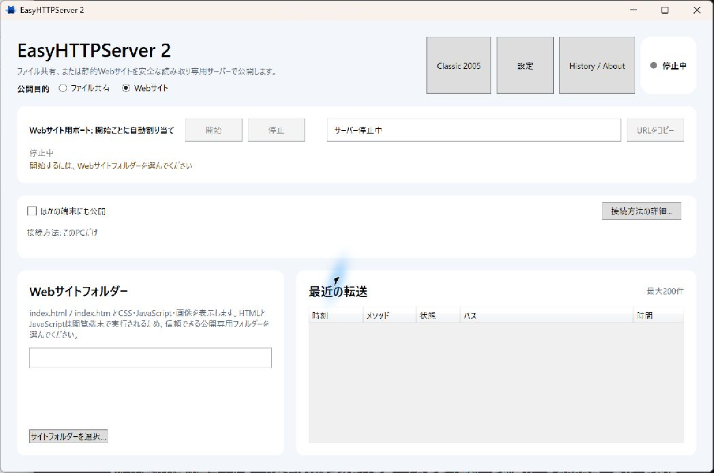

# EasyHTTPServer 2

<p align="center">
  
</p>

<p align="center">
  Windowsでフォルダーを選んで開始する、読み取り専用のファイル共有・静的Webサーバー
</p>

[](https://github.com/moe-charm/EasyHTTPServer/actions/workflows/ci.yml)
[](LICENSE.md)
[](https://github.com/moe-charm/EasyHTTPServer)

EasyHTTPServer 2は、2005年に公開された「簡単WEBサーバー」を、安全性と使いやすさを重視して約20年ぶりに全面刷新したWindowsアプリです。C# / .NET 10、ASP.NET Core Kestrel、WPFで新規実装しています。

> [!WARNING]
> `legacy/`の旧版ソースは歴史資料です。現在のLANやインターネットへ公開して使用しないでください。新版もインターネットへ直接ポート公開せず、遠隔共有には信頼できるVPNを使用してください。

<p align="center">
  
</p>

## 主な機能

- フォルダーを選び「開始」を押すだけの読み取り専用ファイル共有
- 複数フォルダー、自動目次、Range、ダウンロード再開、大容量ストリーミング
- `index.html`、CSS、JavaScript、画像などを表示する静的Webサイトモード
- localhost、家庭内LAN HTTPS、明示選択したVPNアダプターへの公開
- LAN/VPN公開時の一時証明書、8桁ペアリング、Host/Origin検証
- パストラバーサル、ADS、reparse point、危険な能動形式への対策
- Modern / Classic 2005テーマ、QRコード、転送状況、履歴表示
- CGI、アップロード、削除、Basic認証は非対応

## はじめる

[GitHub Releases](https://github.com/moe-charm/EasyHTTPServer/releases)からWindows x64用ZIPをダウンロードし、任意の短いフォルダーへ展開して`EasyHTTPServer.exe`を実行します。インストーラーは不要です。自己完結型ZIPには.NETランタイムが同梱されます。

ZIPと同じReleaseにある`SHA256SUMS.txt`で、ダウンロードしたファイルのSHA-256を確認できます。

```powershell
Get-FileHash .\EasyHTTPServer-2.0.0-alpha.1-win-x64.zip -Algorithm SHA256
```

初回起動時は説明書フォルダーが共有に登録されています。そのまま「開始」を押すと、このPCのブラウザーで操作を試せます。自分のファイルを共有する場合は「追加…」からフォルダーを選びます。

### 公開範囲

- **このPCだけ**: 既定値です。認証なしのlocalhost HTTPで利用します。
- **同じWi-Fi・家庭内LAN**: HTTPSと短時間ペアリングを必須にします。
- **VPN**: Tailscaleなどの対象アダプターを利用者が明示的に選びます。

アプリがVPNやネットワークを勝手に選ぶことはありません。証明書警告を無確認で回避せず、画面に表示されるSHA-256指紋を接続先端末でも照合してください。

> [!NOTE]
> 現在の配布版はコード署名されていません。Windowsが警告を表示する場合があります。配布物のSHA-256を公開値と照合してください。

## ソースからビルド

必要環境:

- Windows 10またはWindows 11
- .NET 10 SDK（`global.json`指定版または互換Feature Band）

```powershell
git clone https://github.com/moe-charm/EasyHTTPServer.git
cd EasyHTTPServer
dotnet restore EasyHTTPServer.sln
dotnet test EasyHTTPServer.sln
dotnet run --project src/EasyHttpServer.Desktop.Wpf
```

自己完結型ZIPの生成:

```powershell
pwsh -File scripts/build-release.ps1 -Version 2.0.0-alpha.1
```

出力は`artifacts/release/<version>/`に作られ、Git管理には含まれません。

## リポジトリ構成

| パス | 内容 |
| --- | --- |
| `src/` | Core、Kestrelサーバー、WPFアプリ |
| `tests/` | 単体・統合テスト |
| `Guide/` | 配布版に同梱する利用者向け説明書 |
| `docs/` | アーキテクチャ、セキュリティ、配布設計 |
| `legacy/source-1.2/` | 作者charmpicによる2005～2006年版の歴史的ソース |
| `scripts/` | Release ZIP生成スクリプト |

## セキュリティ

設計と脅威境界は[セキュリティ設計](docs/security.md)、LAN/VPN公開は[共有セッション設計](docs/share-session-security.md)を参照してください。脆弱性を見つけた場合は、公開Issueへ詳細を書かず、[SECURITY.md](SECURITY.md)の手順で報告してください。

旧版には現代の基準では危険なパス解決、CGI、Basic認証、HTTP解析、Range処理があります。旧設定や配布バイナリはこの公開リポジトリに含めていません。

## ドキュメント

- [製品方針](docs/product-vision.md)
- [アーキテクチャ](docs/architecture.md)
- [Webサイトモード設計](docs/website-mode.md)
- [Windows配布設計](docs/release-distribution.md)
- [旧版の来歴と保存範囲](legacy/README.md)
- [現在のタスク](current_task.md)
- [コントリビューションガイド](CONTRIBUTING.md)

## ライセンス

EasyHTTPServer 2の現代版コードと文書は[MIT License](LICENSE.md)です。Copyright (c) 2005-2026 charmpic.

`legacy/`の歴史資料は元の表記と条件を維持し、MITへの再ライセンス対象ではありません。第三者コンポーネントは[THIRD-PARTY-NOTICES.txt](THIRD-PARTY-NOTICES.txt)を参照してください。
